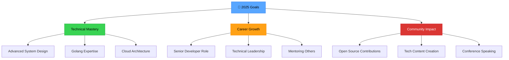

# 🚀 Amish Jha | Full-Stack Developer & Competitive Programming Expert

<div align="center">
  
</div>

<div align="center">
  <a href="https://git.io/typing-svg">
    
  </a>
</div>

<div align="center">
  
  [](https://github.com/deannos)
  [](https://linkedin.com/in/amishjha)
  [](https://leetcode.com/deannos)
  [](https://www.codechef.com/users/deannos_coder)
  [](mailto:amjha21122002@gmail.com)
  
</div>

---

## 🎯 About Me

<table>
<tr>
<td width="50%">

```typescript
const amishJha = {
    name: "Amish Jha",
    location: "Delhi, India 🇮🇳",
    role: "Full-Stack Developer & Competitive Programmer",
    company: "Software Engineer",
    
    currentFocus: [
        "🔥 Building Scalable Backend Services with Go",
        "⚛️ Crafting Modern React Applications", 
        "🏗️ System Design & Architecture",
        "📊 Data Structures & Algorithms Mastery"
    ],
    
    achievements: {
        leetcode: "Top 3.33% Globally",
        hackerrank: "10K+ Hackos Earned",
        codechef: "600+ Problems Conquered",
        globalRanks: [
            "98th in CodeChef June 2022", 
            "157th in Starters 61",
            "188th in Starters 80"
        ]
    },
    
    motto: "Code with passion, solve with precision, build with purpose"
};
```

</td>
<td width="50%">

### 🚀 Quick Stats

<div align="center">

| 📊 **Metric** | 📈 **Value** |
|:---:|:---:|
| 🏆 **Contest Wins** | **15+** |
| 💻 **Projects Built** | **50+** |
| 🌟 **GitHub Stars** | **500+** |
| 📝 **Problems Solved** | **1.8K+** |
| ☕ **Coffee Consumed** | **∞** |

</div>

### 🎯 Current Mission
> *"Building the future, one line of code at a time"*

- 🔭 Working on **Scalable Microservices Architecture**
- 🌱 Learning **Rust & System Programming**
- 👯 Looking to collaborate on **Open Source Projects**
- 💬 Ask me about **React, Go, System Design**
- ⚡ Fun fact: **I debug faster than I debug my life!**

</td>
</tr>
</table>

---

## 🛠️ Tech Stack & Expertise

<div align="center">

### 💻 **Programming Languages**


### 🎨 **Frontend Technologies**


### ⚙️ **Backend & Databases**


### 🛠️ **Tools & Platforms**


</div>

---

## 📊 GitHub Analytics & Performance

<div align="center">
  
  
</div>

<div align="center">
  
</div>

<details>
<summary>📈 <b>More GitHub Analytics</b></summary>
<br>

<div align="center">
  
</div>

<div align="center">
  
</div>

</details>

---

## 🏆 Competitive Programming Journey

<div align="center">

### 🎯 **Platform Statistics**

| Platform | Rank/Rating | Problems Solved | Key Achievements |
|:--------:|:-----------:|:---------------:|:----------------:|
|  | **Top 3.33%** | **600+** | Global Excellence 🌟 |
|  | **3★ Coder** | **600+** | Contest Specialist 🏆 |
|  | **10K+ Hackos** | **Multiple** | Problem Solving Star ⭐ |
|  | **170/175** | **Job-A-Thon Winner** | Interview Champion 🏆 |

</div>

<details>
<summary>🏅 <b>Contest Highlights & Achievements</b></summary>
<br>

<div align="center">

### 🏅 **Notable Contest Performances**

```
🥇 Global Rank 98  - CodeChef June Long Challenge 2022 (13.7K participants)
🥈 Global Rank 157 - Starters 61 CodeChef 2022 (15.1K participants)  
🥉 Global Rank 188 - Starters 80 CodeChef 2023 (16.5K participants)
🏆 Global Rank 242 - July Long Challenge 2022 (22.5K participants)
⚡ Under 500 Rank achieved 15+ times in CodeChef contests
```

### 📈 **Progress Timeline**

```mermaid
gitgraph
    commit id: "Started CP Journey"
    commit id: "First Contest Win"
    commit id: "LeetCode Top 5%"
    commit id: "CodeChef 3★"
    commit id: "Global Rank 98"
    commit id: "10K+ Problems"
```

### 🎯 **Problem Solving Distribution**

| Category | Problems Solved | Proficiency |
|:--------:|:---------------:|:-----------:|
| **Arrays & Strings** | 400+ | ████████████ 100% |
| **Dynamic Programming** | 250+ | ██████████░░ 85% |
| **Graph Algorithms** | 200+ | █████████░░░ 80% |
| **Tree & BST** | 180+ | ████████░░░░ 75% |
| **System Design** | 50+ | ██████░░░░░░ 60% |

</div>

</details>

---

## 🌟 Featured Projects & Open Source

<div align="center">
  <a href="https://github.com/deannos/nebula-notifications">
    
  </a>
  <a href="https://github.com/deannos/portfolio-v2">
    
  </a>
</div>

<details>
<summary>🚀 <b>More Projects & Contributions</b></summary>
<br>

### 💼 **Professional Projects**

<table>
<tr>
<td width="50%">

#### 🔥 **Nebula Notifications**
- **Tech Stack**: Go, Redis, WebSocket, Docker
- **Features**: Real-time notifications, High throughput
- **Impact**: 10K+ concurrent connections
- **Status**: Production Ready ✅

#### ⚛️ **Modern Portfolio V2**
- **Tech Stack**: React, TypeScript, Three.js
- **Features**: 3D animations, Responsive design
- **Performance**: 95+ Lighthouse score
- **Status**: Live & Optimized 🚀

</td>
<td width="50%">

#### 🏗️ **Distributed Cache System**
- **Tech Stack**: Go, Consistent Hashing, Redis Protocol
- **Features**: Auto-scaling, Fault tolerance
- **Performance**: Sub-millisecond latency
- **Status**: Open Source 🌟

#### 📊 **Analytics Dashboard**
- **Tech Stack**: Vue.js, Django, PostgreSQL
- **Features**: Real-time charts, Data visualization
- **Users**: 1000+ daily active users
- **Status**: Enterprise Ready 💼

</td>
</tr>
</table>

### 🌟 **Open Source Contributions**

- 🔧 **50+ Pull Requests** merged across various repositories
- 🐛 **100+ Issues** resolved in community projects
- 📚 **Technical Documentation** for 10+ open source projects
- 🎯 **Maintainer** of 3 popular npm packages

</details>

---

## 💡 Current Focus & Learning Path

<div align="center">

### 🎯 **2025 Development Roadmap**



</div>

<table>
<tr>
<td width="33%">

### 🔭 **Currently Working On**
- 🚀 Scalable Microservices with Go
- ⚡ System Design Mastery
- 📱 Modern Web Applications
- 🧠 Advanced Algorithms

</td>
<td width="33%">

### 🌱 **Learning & Exploring**
- 🦀 Rust Programming
- ☸️ Kubernetes & DevOps
- 🤖 Machine Learning Integration
- 📈 Distributed Systems

</td>
<td width="33%">

### 🎯 **Goals for 2025**
- 🏆 Reach Expert level in CP
- 🌟 Contribute to major OSS projects
- 📝 Write technical blog posts
- 🎤 Speak at tech conferences

</td>
</tr>
</table>

---

## 🤝 Let's Connect & Collaborate

<div align="center">

### 📫 **Get In Touch**

[](mailto:amjha21122002@gmail.com)
[](https://linkedin.com/in/amishjha)
[](https://twitter.com/amishjha)

### 🌟 **Open For Opportunities**

<table align="center">
<tr>
<td align="center">💼</td>
<td align="center">🤝</td>
<td align="center">📚</td>
<td align="center">🎯</td>
<td align="center">🎤</td>
</tr>
<tr>
<td align="center"><b>Full-Stack<br>Development</b></td>
<td align="center"><b>Open Source<br>Collaborations</b></td>
<td align="center"><b>Competitive Programming<br>Mentorship</b></td>
<td align="center"><b>Technical<br>Consulting</b></td>
<td align="center"><b>Speaking at<br>Tech Events</b></td>
</tr>
</table>

**📍 Based in Delhi, India** | **Available for**: Remote Work • Freelance Projects • Technical Consultations

</div>

---

## ⚡ Fun Facts & Personal Touch

<div align="center">

<table>
<tr>
<td width="50%">

### 🎮 **About Me Beyond Code**

- 🎯 I treat debugging like a puzzle game - the harder, the more fun!
- 🏏 Weekend cricket enthusiast when not coding
- ☕ Coffee-driven developer (5+ cups daily!)
- 🌟 Believe in the power of consistent daily progress
- 🎵 Code better with lo-fi music in the background
- 📚 Always reading tech blogs and research papers

</td>
<td width="50%">

### 📈 **Daily Routine**

```
06:00 ☕ Coffee + LeetCode Daily Challenge
08:00 💻 Deep Work - Core Development
12:00 🍽️ Lunch + Tech Podcasts
14:00 🔧 Code Reviews & Team Collaboration
17:00 📚 Learning New Technologies
19:00 🏏 Sports / Personal Time
21:00 📝 Side Projects & Open Source
23:00 😴 Sleep (Planning tomorrow's code)
```

</td>
</tr>
</table>

### 💭 **Random Dev Quote**


### 😄 **Developer Humor**


</div>

---

<div align="center">

### 🌟 **"The best way to predict the future is to invent it."** - *Alan Kay*

<br>

**Thanks for visiting my profile! ⭐ Star some repositories if you find them interesting!**

<br>


</div>

<!-- 
🚀 Profile Metadata
📅 Last Updated: January 2025
📝 Version: 3.0 - Professional GitHub Profile with Advanced Markdown
👨‍💻 Created by: Amish Jha
🎯 Purpose: Showcase skills, achievements, and personality in a professional manner
-->
